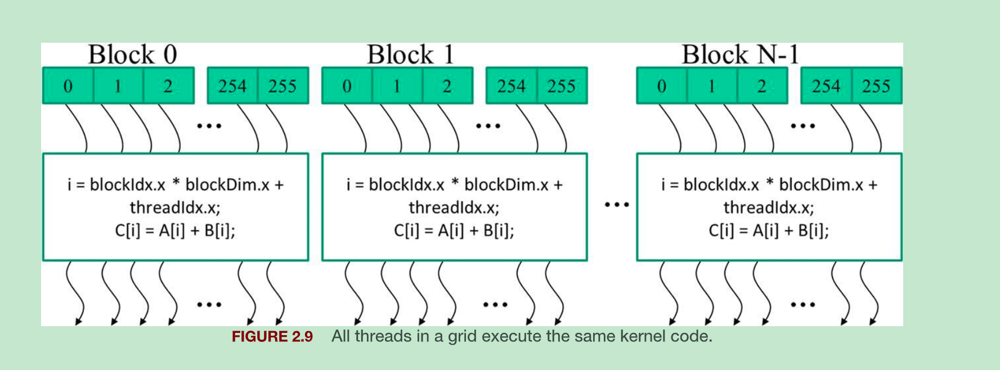

## CUDA C program structure
Any CUDA C program has 2 parts:
- Host(CPU) code
- One or more devices(GPUs) code       

By default, any traditional C code is a CUDA program which contains only host code. The device code marked with special CUDA C keywords and includes functions or kernels which is executed in a data-parallel manner.

- Execution starts with host code. When a kernel function is called, a large number of threads are launched on a device(GPU) to execute the kernel. All the threads that are launched by a kernel collectively termed as a ***grid***.
- *Grid* is organized as an array of ***thread blocks*** (also referred as ***blocks***). All blocks are of same size and each block can contain upto 1024 threads in CUDA.
- The number of threads in a block is accessed by a built-in variable named ***blockDim*** in CUDA. blockDim is a struct which has 3 variables x, y and z. The choice of dimensionality depends on the organization of data. If a thread block is organized as a one-dimensional array, then ***blockDim.x*** variable indicate the total number of threads in each block.
- Recommendation is number of threads in each dimension of a thread block should be multiple of 32.
- ***threadIdx*** variable gives each thread a unique coordinate within a thread block (or block). ***threadIdx.x*** value for each thread is shown in green colored box.
- ***blockIdx*** variable gives all threads in a block a command block coordinate.
- threadIdx and blockIdx allows threads to distinguish themselves from each other and determine the part of data each thread is to work on.
  - 
  - Each thread can combine blockIdx, threadIdx and blockDim to create a unique global index for itself within the entire grid.
  - Unique global index `i = blockIdx.x * blockDim.x + threadIdx.x`. For blockDim = 256, 
    - In block 0, i range from 0 to 255
    - In block 1, i range from 256 to 511
    - In block 2, i range from 512 to 767
- 4 concepts (all of them are a struct which consists of 3 integers x, y and z): 
<pre>
  - girdDim   : dimension of a grid in terms of number of blocks
  - blockDim  : dimension of a block in terms of number of threads
  - blockIdx  : unique coordinate of a block within a grid
  - threadIdx : unique coordinate of a thread within a grid
</pre>

## Multidimensioanl grids and data
- To access dynamically allocated multidimensional array as A[j][i], C or CUDA compiler needs to know the value of column at compile time. This is because modern computer uses *flat* memory space. But this requirement contradicts with the purpose of *dynamically allocated* part. Therefore we need to access the elements of dynamically allocated multidimensional array as flatten 1-d array.
- 2 ways to flatten multidimensional array:
  - row-major
  - column-major

## Matrix Multiplication
Since the size of a grid is limited by number of blocks in a grid and number of threads in a block, the size of largest output matrix is alspo constrained by this limit. Tricky case is when output matrix is larger then this limits, then how do you perform matrix multiplication.