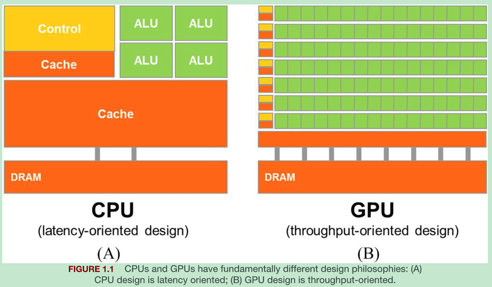

## History
Historically any computer application rely on advancement of *processor speed*, *memory speed* and *memory capacity* to enhance their capability. Recently, deep learning related applications have demanded more execution speed and resources, which have fueled aggressive development in compute device capabilities. During 1980s and 1990s, microprocessors based on *single CPU* (such as x86 processor from Intel and AMD) which executes intruction sequentially and have fast *clock frequency* and *resource* brought GFLOPS (109) in desktop PCs and TFLOPS (1012) to data centers. The sequence of instruction activities resulting from this sequential, step wise execution of an application is referred as ***thread***. There are limitations of single CPU based microprocessor and sequential programs:   
- This microprocessor could not be advanced further because of energy consumption and heat dissipation issues, which limit the increase of *clock frequency* and productive activities that can be performed in *single clock cyle*.
- At end of the day a sequential program will run on only one microprocessor which will not be significantly faster from microprocessor's generation to generation.   
   
Therefore all microprocessors have started using multiple CPUs, referred as ***cores***. In order to benefit from this new design, uers must have multiple instructions either from same or different applications which can execute in parallel. Since 2003, semiconductor industry has settled on 2 main trajectories of microprocessor:

| Multicore based microprocessor                                                                  | Many-thread based microprocessor                                                                                               |
| ----------------------------------------------------------------------------------------------- | ------------------------------------------------------------------------------------------------------------------------------ |
| CPUs are based on this philosophy                                                               | GPUs are based on this philosophy                                                                                              |
| Focus on latency                                                                                | Focus on throughput                                                                                                            |
| *out-of-order* based implementation:  an implementation which can get something else done while the processor waits for the data to be delivered from memory        | *in-order* based implementation:  an implementation that would just stall until the data becomes available                  |
| Intel 24-core processor has  0.33 TFLOPS for double-precision,  0.66 for single-precision | Nvidia A100 GPU has  9.7 TFLOPS for double-precision,  156 TFLOPS for single-precision, 312 TFLOPS for half-precision |
| CPU takes thousands of clock cycles to generate and schedule threads                            | GPU takes very few clock cycles to generate and schedule threads (ref: Ch:2.2)                                                 |

### CPU vs GPU

CPU:
- Less arithmetic logic units (ALUs) and operand data delivery logic units to minimize latency of arithmetic operation at the cost of *increased use of chip area and power per unit*.
- By reducing the latency of each operations, CPU hardware reduces the latency of each individual thread.
- Launching a thread or switching b/w threads has overhead because each time you have to load the state of the thread as well i.e. all the register values and you also have to take snapshot of the thread states.
  
GPU:
- Inspired from video game industry, GPU has to perform a massive number of floating point calculations and memory accesses per video frame. It means GPUs need to maximize chip area and power to accommodate more and more units (like ALUs).
- A GPU must be capable of moving extremely large amount of data in/out of graphics frame buffers in its DRAM.
- Launching or switching threads is seamless because state of the thread is always available.

> Note: Reducing latency is much more expensive than increasing throughput in terms of power and chip area. Example:   
> - If we want 2x the airthmetic throughput, then we can 2x the # of airthmetic units at the cost of 2x the chip area and 2x power consumption.
>  - If we want 1/2x the airthmetic latency, then we have to 2x the current at the cost of more than 2x the chip area and 4x the power consumption.

### Why CUDA invented?
For programs that have one or very few threads, CPUs with lower operation latencies can achieve higher performance than GPUs. Whereas for programs that have huge number of threads, GPUs with higher execution throughputs can achieve higher performance than CPUs. Therefore, a user or application may need both CPU and GPU. That is why Compute Unified Device Architecture (CUDA) programming model is introduced in 2007. Factors affecting selection of processors:
- Performance
- Installed base of the processor
  - If a application that can run only on processor with a small market presence, then that application will not have large consumer base. 
- Practical form factors and easy accessibility
  - Until 2006, GPGPU (General Purpose GPU) program needs to use equivalent graphics API like OpenGL or Direct3D to execute computation on processing units. This limits the type of application that can built on top of GPUs.
  - With release of CUDA on 2007, everything changed. CUDA not only brings software changes but also additional hardware was added to the chip.

### Speeding of an application
Level of speed up of an application through parallel execution can be limited by the parallelizable portion of the application is referred as ***Amdahl's law***. Factor on which speedup of an application depends on:
- Portion of application that can be parallalized
- How fast data can be accessed from and written to the memory. In reality, parallelization of an application often saturates the memory (DRAM) bandwidth. The trick is to get around memory bandwidth problem by utilizin the GPU on-chip memories to drastically reduce the number of accesses to the DRAM (memory),

Challenges in parallel programming:
- Design parallel algorithms with the same level of algorithmic complexity as that of sequential algorithms.
- Execution speed of many applications is limited by memory access latency and/or throughput referred as **memory bound applications**. In contrast **compute bound applications** are limited by the number of instructions performed per byte of data.
- Execution speed of parallel programs is more sensitive to the input data characteristics (unpredictable data sizes, uneven data distributions) than is the case for their sequential counterparts. These uneven size and distribution can cause uneven amount of work to be assigned to the parallel threads and can significantly reduce the effectiveness of parallel execution.
- Some application requires very litte collaboration across different threads, referred as *embarassingly parallel*. Other applications require threads to collaborate with each other, which requires using *synchronization operations* like barriers or atomic operations. This synchronization impose overhead because threads find often waiting for other threads instead of performing useful work.

## Things to know about GPU
- DRAM (Dynamic Random Access Memory) also called as Global Memory.
- All threads in GPU perform same code, this programming model termed as Single Program Multiple Data (***SPMD***). SPMD is not same as Single Instruction Multiple Data (***SIMD***). In SPMD system, the parallel processing units execute the same program on multiple parts of the data. Whereas in SIMD system, all processing units are executing the same instruction at any instant.

## Things to know about Nvidia GPU
- They operator on 2 types of driver model:
  - WDDM driver model is used display devices
  - Tesla Compute Cluster (TCC) is used for non-display devices like Nvidia Tesla GPUs and GeForce GTX Titan GPUs. It uses windows WDM driver model.